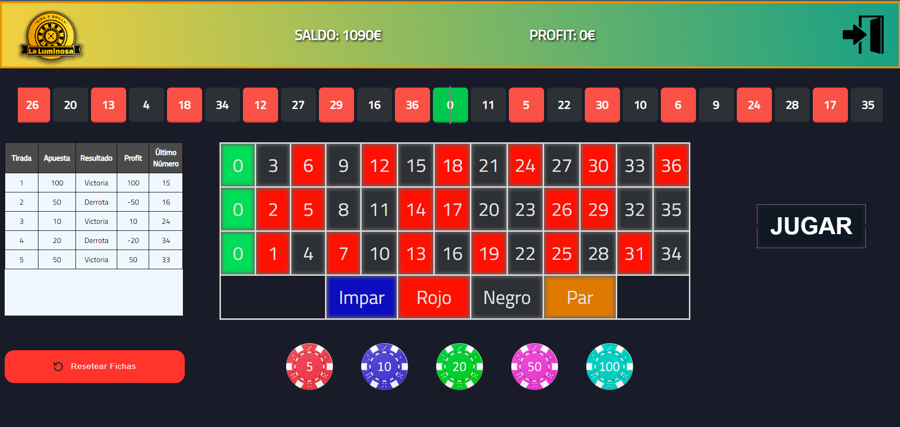
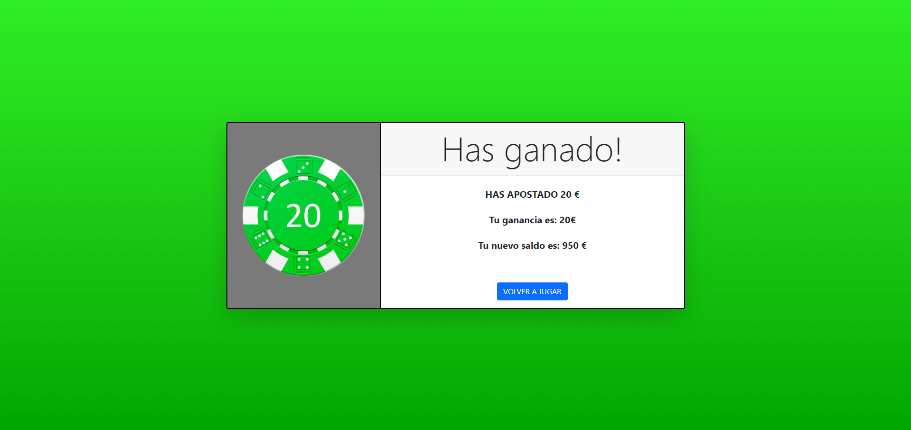
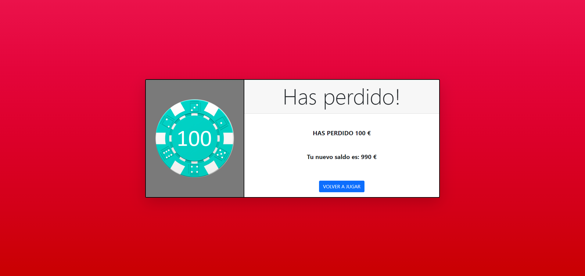

# LaLuminosa

Proyecto Final de la Asignatura de Metodología y Desarrollo de Aplicaciones Interactivas del 4 año de Ingeniería Informática

## Descripción

Proyecto creado para conocer el framework de SpringBoot para la creación de una aplicación web en conjunto con Thymeleaf para la vista. Se usa el patrón Modelo - Vista - Controlador (MVC)

La aplicación web consiste en una ruleta básica de casino donde se pueden hacer diferentes apuestas sobre un tablero. Tiene un sistema de login y registro para verificar que no hay 2 usuarios iguales y que solo pueden jugar a la ruleta aquellos usuarios que se hayan logueado.

## Autores (contributors)

[@Julián Blanco González](https://github.com/JulianBlanco98)

[@Ignacio Guerrero Noguera](https://github.com/ignaciogn)

## Capturas del proyecto

### Pantalla Principal

### Victoria

### Derrota

